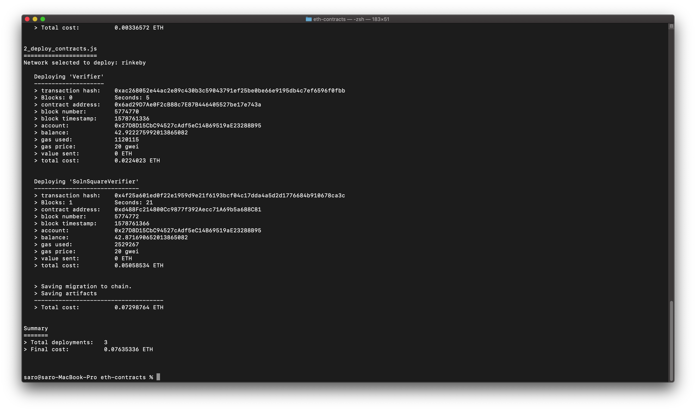
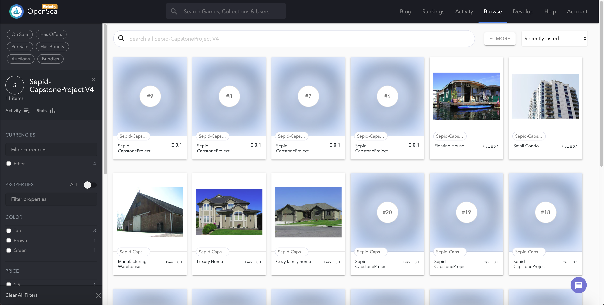

# Udacity Blockchain Real State Capstone Project

### PROBLEM
At present, property titles are often paper-based, creating opportunities for errors and fraud. Title professionals find defects in 25% of all titles during the transaction process, according to the American Land Title Association.

Any identified defect makes it illegal to transfer a property title to a buyer until it is rectified. This means property owners often incur high legal fees to ensure authenticity and accuracy of their property titles.

Moreover, title fraud poses a risk to homeowners worldwide. US losses associated with title fraud reportedly averaged around $103,000 per case in 2015, compelling many property buyers to purchase title insurance.

Reference: [Udacity BDND program](https://classroom.udacity.com/nanodegrees/nd1309/parts/48aa25b7-ae11-4349-93c3-c83361e8fa4c/modules/43d200d0-9ce6-4e20-b1c0-39a4e00ac275/lessons/d35b025b-01b3-4bd9-acf5-e8bb5b88f00c/concepts/4d2728c0-0886-4ba2-aa61-bf1362bc3664)

### SOLUTION
These title management issues could potentially be mitigated by using blockchain technology to build immutable digital records of land titles and using blockchain for transparent transactions. This approach could simplify property title management, making it more transparent and helping to reduce the risk of title fraud and the need for additional insurance.

Reference: [Udacity BDND program](https://classroom.udacity.com/nanodegrees/nd1309/parts/48aa25b7-ae11-4349-93c3-c83361e8fa4c/modules/43d200d0-9ce6-4e20-b1c0-39a4e00ac275/lessons/d35b025b-01b3-4bd9-acf5-e8bb5b88f00c/concepts/4d2728c0-0886-4ba2-aa61-bf1362bc3664)

## Project description
- Smart contracts:
You will find the smart contract under "eth-contracts" folder. In this folder you will find a standard smart contracts development architecture based on Truffle.

- zk-Snark:
You will find the verification code and some proof_*.json files used to mint 10 tokens in the ERC721 smart contract deployed on Rinkeby network.

- OpenSea Market place:
To access to the store front for the ERC721 smart contract please use the following link: https://rinkeby.opensea.io/assets/sepid-capstoneproject

## Getting Started

Clone or download this repository

### Pre-requisites

Please make sure you've already installed ganache-cli, Truffle and enabled MetaMask extension in your browser.

- Install ganache (graphical interface) and ganache-cli in your local environment
Donwload the installer from [https://truffleframework.com/ganache]

```
npm install -g ganache-cli
```

###  Libraries used
In each subfolder you will find the package.json to build each part. Here a summary of the most important packages used during the implementation.

- node.js (Version 10.16.0): As an asynchronous event driven JavaScript runtime, Node is designed to build scalable network applications.

- web3 (Version 1.2.1 and Version 1.2.1 for the client): This is the Ethereum JavaScript API which connects to the Generic JSON RPC spec to connect to the ethereum node an interact with the smart contract.

- truffle-hdwallet-provider (Version 1.0.5): HD Wallet-enabled Web3 provider. Use it to sign transactions for addresses derived from a 12-word mnemonic. Package to access to a provider in case you want to deploy the smaret contract in a public network like Rinkeby, Ropsten, etc.

- Truffle (Version 5.1.7): Truffle is a development environment, testing framework and asset pipeline for Ethereum, aiming to make life as an Ethereum developer easier.

#### zk-Snark
- Intsall Docker in your computer.

[How to install Docker](https://docs.docker.com/install/)

- Change directory to ```zokrates\code``` folder.

```
cd zokrates\code
```

- Run ZoKrates docker container:

```
docker run -v <path to your project folder>/zokrates/code/:/home/zokrates/code -ti zokrates/zokrates /bin/bash
```
Your terminal should look something like this:


- I wrote a [generateProofs.sh](./zokrates/code/square/generateProofs.sh) script. Execute it as follow:

```
./generateProofs.sh
```
Your terminal should look something like this:


- Export Verifier.sol contract

```
~/zokrates export-verifier
```
Your terminal should look something like this:


#### Smart Contracts
- In a new terminal change directory to ```eth-contracts``` folder and install all requisite npm packages (as listed in ```package.json```):

```
cd eth-contracts
npm install
```

- Launch Ganache: I prefer to use the Ganache GUI instead of ganache-cli but only take in consideration to use the port 7545. Otherweise you have to update several configuration files in which this port is hard coded. Other consideration is to configure your ganache to use at least 40 accounts. When you want to test the oracle part it will be necessary to have this amount of accounts

**(Optional if you want to deploy the contract in a public network like Rinkeby!)** Change the constant MNEMONIC with your account menomic and change API_KEY with your infura API Key

- Compile smart contracts:

```
truffle compile
```

Your terminal should look something like this:


- Migrate smart contracts to the locally running blockchain, ganache GUI or ganache-cli:

```
truffle migrate --network development
```

Your terminal should look something like this:


- Migrate smart contracts to the Rinkeby network running blockchain, ganache GUI or ganache-cli:

```
truffle migrate --network rinkeby
```

Your terminal should look something like this:




- Test smart contracts:

To test the oracle part I have created a separate test file. You will find under ```eth-contracts\test\*.js```. To execute it please call it using the following npm script

```
npm run test
```

With that script you will run the three tests files. Your terminal should look something like this:


All 14 tests shall pass.

**(Assumption: in the SolnSquareVerifier contract I am verifing for each token token mint if the solution is unique and pass the verification)**


#### Deployment in Rinkeby network and search the tokens mint using OpenSea store front.

- Address for the deployed ERC721 contract in Rinkeby network:

```https://rinkeby.etherscan.io/address/0xb0159163fCF9FF0C87af39469c657e39e40A5F65```

Here you can check all the transactions over the smart contract

- Address to access to the OpenSea store front and the tokens list:

```https://rinkeby.opensea.io/assets/sepid-capstoneproject```




# Project Resources

* [Remix - Solidity IDE](https://remix.ethereum.org/)
* [Visual Studio Code](https://code.visualstudio.com/)
* [Truffle Framework](https://truffleframework.com/)
* [Ganache - One Click Blockchain](https://truffleframework.com/ganache)
* [Open Zeppelin ](https://openzeppelin.org/)
* [Interactive zero knowledge 3-colorability demonstration](http://web.mit.edu/~ezyang/Public/graph/svg.html)
* [Docker](https://docs.docker.com/install/)
* [ZoKrates](https://github.com/Zokrates/ZoKrates)
* [OpenSea](https://docs.opensea.io/)
